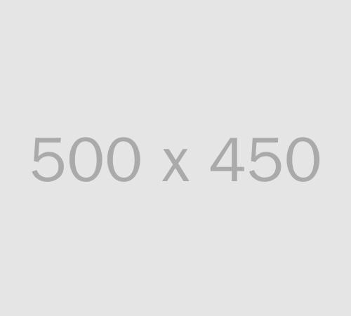

# Image Generator Service

A high-performance image generation service that creates images with text overlays using custom fonts.

## Table of Contents

- [Purpose](#purpose)
- [Features](#features)
- [Usage](#usage)
  - [API Endpoints](#api-endpoints)
  - [Examples](#examples)
  - [Performance](#performance)
- [Prerequisites](#prerequisites)
- [Installation](#installation)
  - [Local Installation](#local-installation)
  - [Docker Installation](#docker-installation)
- [Configuration](#configuration)
- [Development](#development)
  - [Available Make Commands](#available-make-commands)
  - [Building from Source](#building-from-source)
- [Docker Support](#docker-support)
  - [Building Docker Image](#building-docker-image)
  - [Running in Docker](#running-in-docker)
  - [Cleaning Docker Resources](#cleaning-docker-resources)
- [Logging](#logging)
- [Contributing](#contributing)
- [Acknowledgments](#acknowledgments)
- [License](#license)

## Purpose

This project provides a RESTful API for generating images dynamically based on various parameters. The API allows users to specify the image dimensions, background color, text content, text color, and font size to create customized images.

## Features

- Dynamic image generation: Creates images on-the-fly based on user-provided parameters
- Customizable parameters: Allows users to specify dimensions, colors, text, and font size
- Flexible API endpoints: Offers multiple endpoints for different image sizes and parameters
- Performance optimization: Leverages efficient image generation techniques for optimal performance
- Font management system with support for TTF, OTF, WOFF, and WOFF2 fonts
- RESTful API endpoints with health checks
- Graceful shutdown handling
- Structured JSON logging
- Docker support
- Configurable via environment variables

## Usage

### API Endpoints

- `GET /health` - Health check endpoint
- `GET /img/{width}/{height}[/{bgColor}/{text}/{textColor}/{fontSize}]` - Generate image with text
  - Parameters:
    - `width`: Image width in pixels
    - `height`: Image height in pixels
    - `bgColor`: Background color in hex format (optional)
    - `text`: Text content to display (optional)
    - `textColor`: Text color in hex format (optional)
    - `fontSize`: Font size in pixels (optional)

### Examples

Generate a simple image:
```
http://localhost:8080/img/500/450
```


Generate an image with text:
```
http://localhost:8080/img/800/250/1D7373/Hello%20World/FFFFFF/100
```
This will create an image with:
- Width: 800 pixels
- Height: 250 pixels
- Background color: #1D7373
- Text: "Hello World"
- Text color: #FFFFFF
- Font size: 100


### Performance

The API has been designed with performance in mind. Benchmark tests using wrk have demonstrated high request rates and low latency:

```bash
# Small image (100x100)
Requests/sec:    450.64
Transfer/sec:    473.53KB

# Minimal image (1x1)
Requests/sec:    524.48
Transfer/sec:    358.53KB

# Health check endpoint
Requests/sec:  61235.01
Transfer/sec:      7.01MB
```

## Prerequisites

- Go 1.24 or higher
- Docker (optional, for containerized deployment)
- Make (for using Makefile commands)

## Installation

### Local Installation

1. Clone the repository:
```bash
git clone https://github.com/romanitalian/img-generate.git
cd img-generate
```

2. Install dependencies:
```bash
go mod download
```

3. Build the application:
```bash
make build
```

### Docker Installation

Build and run using Docker:
```bash
make docker-build
make docker-run
```

## Configuration

The service can be configured using environment variables:

| Variable | Description | Default |
|----------|-------------|---------|
| `PORT` | Server port | `8080` |
| `FONT_DIR` | Directory for font files | `./fonts` |
| `LOG_LEVEL` | Logging level (debug, info, warn, error) | `info` |

## Development

### Available Make Commands

- `make help` - Show available commands
- `make build` - Build the application
- `make run` - Run the application
- `make test` - Run tests
- `make clean` - Clean build artifacts
- `make docker-build` - Build Docker image
- `make docker-run` - Run Docker container
- `make docker-clean` - Clean Docker resources

### Building from Source

```bash
make build
```

The binary will be created in the `bin` directory.

## Docker Support

### Building Docker Image

```bash
make docker-build
```

### Running in Docker

```bash
make docker-run
```

### Cleaning Docker Resources

```bash
make docker-clean
```

## Logging

The service uses structured JSON logging with the following levels:
- DEBUG: Detailed debugging information
- INFO: General operational information
- WARN: Warning messages
- ERROR: Error messages

## Contributing

1. Fork the repository
2. Create your feature branch (`git checkout -b feature/amazing-feature`)
3. Commit your changes (`git commit -m 'Add some amazing feature'`)
4. Push to the branch (`git push origin feature/amazing-feature`)
5. Open a Pull Request

## Acknowledgments

- [Go](https://golang.org/)
- [Docker](https://www.docker.com/)
- [Zerolog](https://github.com/rs/zerolog) for structured logging

## License

This project is licensed under the MIT License - see the LICENSE file for details.
